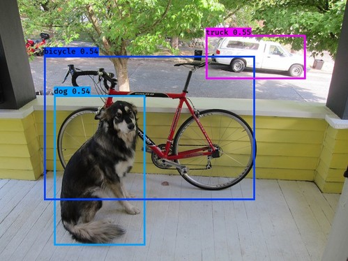

# YAD2K: Yet Another Darknet 2 Keras

[](LICENSE)

## Welcome to YAD2K

You only look once, but you reimplement neural nets over and over again.

YAD2K is a 90% Keras/10% Tensorflow implementation of YOLO_v2.

Original paper: [YOLO9000: Better, Faster, Stronger](https://arxiv.org/abs/1612.08242) by Joseph Redmond and Ali Farhadi.



--------------------------------------------------------------------------------

## Requirements

- [Keras](https://github.com/fchollet/keras)
- [Tensorflow](https://www.tensorflow.org/)
- [Numpy](http://www.numpy.org/)
- [h5py](http://www.h5py.org/) (For Keras model serialization.)
- [Pillow](https://pillow.readthedocs.io/) (For rendering test results.)
- [Python 3](https://www.python.org/)
- [pydot-ng](https://github.com/pydot/pydot-ng) (Optional for plotting model.)

### Installation
```bash
git clone https://github.com/allanzelener/yad2k.git
cd yad2k

# [Option 1] To replicate the conda environment:
conda env create -f environment.yml
source activate yad2k
# [Option 2] Install everything globaly.
pip install numpy h5py pillow
pip install tensorflow-gpu  # CPU-only: conda install -c conda-forge tensorflow
pip install keras # Possibly older release: conda install keras
```

## Quick Start

- Download Darknet model cfg and weights from the [official YOLO website](http://pjreddie.com/darknet/yolo/).
- Convert the Darknet YOLO_v2 model to a Keras model.
- Test the converted model on the small test set in `images/`.

```bash
wget http://pjreddie.com/media/files/yolo.weights
wget https://raw.githubusercontent.com/pjreddie/darknet/master/cfg/yolo.cfg
./yad2k.py yolo.cfg yolo.weights model_data/yolo.h5
./test_yolo.py model_data/yolo.h5  # output in images/out/
```

See `./yad2k.py --help` and `./test_yolo.py --help` for more options.

--------------------------------------------------------------------------------

## More Details

The YAD2K converter currently only supports YOLO_v2 style models, this include the following configurations: `darknet19_448`, `tiny-yolo-voc`, `yolo-voc`, and `yolo`.

`yad2k.py -p` will produce a plot of the generated Keras model. For example see [yolo.png](etc/yolo.png).

YAD2K assumes the Keras backend is Tensorflow. In particular for YOLO_v2 models with a passthrough layer, YAD2K uses `tf.space_to_depth` to implement the passthrough layer. The evaluation script also directly uses Tensorflow tensors and uses `tf.non_max_suppression` for the final output.

`voc_conversion_scripts` contains two scripts for converting the Pascal VOC image dataset with XML annotations to either HDF5 or TFRecords format for easier training with Keras or Tensorflow.

`yad2k/models` contains reference implementations of Darknet-19 and YOLO_v2.

`train_overfit` is a sample training script that overfits a YOLO_v2 model to a single image from the Pascal VOC dataset.

## Known Issues and TODOs

- Expand sample training script to train YOLO_v2 reference model on full dataset.
- Support for additional Darknet layer types.
- Tuck away the Tensorflow dependencies with Keras wrappers where possible.
- YOLO_v2 model does not support fully convolutional mode. Current implementation assumes 1:1 aspect ratio images.

## Darknets of Yore

YAD2K stands on the shoulders of giants.

- :fire: [Darknet](https://github.com/pjreddie/darknet) :fire:
- [Darknet.Keras](https://github.com/sunshineatnoon/Darknet.keras) - The original D2K for YOLO_v1.
- [Darkflow](https://github.com/thtrieu/darkflow) - Darknet directly to Tensorflow.
- [caffe-yolo](https://github.com/xingwangsfu/caffe-yolo) - YOLO_v1 to Caffe.
- [yolo2-pytorch](https://github.com/longcw/yolo2-pytorch) - YOLO_v2 in PyTorch.

--------------------------------------------------------------------------------
